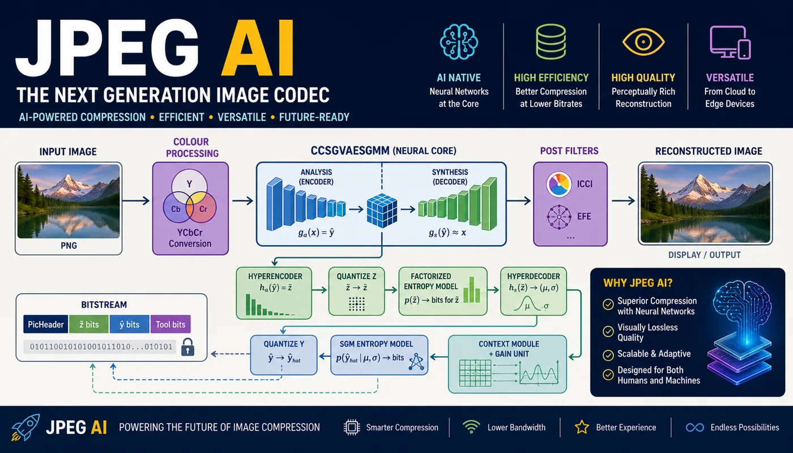

{#fig-hero}

JPEG AI keeps the accounting of a classical codec and discards the fixed parts.
Rate, distortion, entropy, quantization: all still here. The Discrete Cosine
Transform is gone, and so is the wavelet transform of JPEG 2000. In their place
is a pair of neural networks, an analysis transform and a synthesis transform,
trained jointly with a probability model on a large corpus of real images,
against the same rate-distortion objective the codec is later scored on.

I did not set out to read a compression standard. I had an idea I have been
calling the ludicrous one: train a single codec against rate, distortion, and
some generic downstream vision task at the same time, so that a model can
classify or detect straight from the compressed representation without ever
rebuilding the image. Looking for prior art, I found that most of the pieces I
would need are already standardized, in JPEG AI, an ISO/IEC standard since 2025,
with a public reference implementation. This post is me working through that
codec. Whether the ludicrous idea survives contact with it is a separate post,
months from now, carrying either a result or an account of why there isn't one.

**Notation.** $x$ is the image, $\hat{x}$ its reconstruction. $\tilde{y} =
g_a(x)$ is the real-valued latent the analysis transform produces; $\hat{y} =
\lfloor \tilde{y} \rceil$ is its integer-valued quantized form, and the only
version that enters the bitstream. $\hat{z}$ is a second, smaller quantized
latent, the hyper-latent, introduced in @sec-entropy. A hat denotes a quantized
quantity, a tilde a not-yet-quantized one. I write rounding as $\lfloor \cdot
\rceil$ and ignore tie-breaking.

The post follows the codec. @sec-transform is the learned transform and the
argument for learning it. @sec-objective is the objective. @sec-latent and
@sec-vae set up the representation and the training loss. @sec-quant is the
quantization relaxation that makes end-to-end training possible, and I spend
time on it because it is the step most often stated without justification.
@sec-entropy is the entropy model, where latents become bits. @sec-luma through
@sec-roi are the parts that make JPEG AI a deployable standard rather than a
research prototype. @sec-ludicrous is the part I care about.

## Evolution Beyond DCT and Wavelets {#sec-transform}

A lossy image codec has three jobs: decorrelate the pixels into something
sparse, discard what a viewer will not miss, and code what remains near its
entropy. For thirty years the first job was done by a fixed linear transform.
JPEG applies the $8 \times 8$ DCT to each block; JPEG 2000 applies a
biorthogonal wavelet transform to the whole image. Both are good choices for a
specific signal model. The DCT is close to the Karhunen-Loève transform, the
basis that diagonalizes the covariance, for a first-order stationary Gauss-Markov
source with high inter-pixel correlation, which is a fair model of a smooth
photographic patch. Wavelets are the right basis when a signal is a
superposition of structure at many scales with a few large coefficients per
scale.

Real images break the model in specific ways. An edge is a step, not a band of
sinusoids, so the DCT spreads it across many coefficients and you get ringing.
Texture is not a stationary Gaussian field; its statistics shift from one region
to the next. A camera pipeline applies demosaicing, denoising, tone mapping, and
sharpening, all nonlinear, before the codec ever sees the image, and none of
that is in the transform's assumptions. A fixed basis cannot respond to any of
it. It applies the same $8 \times 8$ cosines to a face, a road sign, and a
lawn.

JPEG AI replaces $g_a$ and $g_s$ with convolutional networks and fits them to
data. Concretely, $g_a$ is a stack of strided convolutions that reduce spatial
resolution while increasing channel count: an $H \times W \times 3$ image
becomes roughly an $\tfrac{H}{16} \times \tfrac{W}{16} \times C$ tensor with $C$
in the hundreds. $g_s$ mirrors it with transposed convolutions. Between
convolutions sits generalized divisive normalization rather than a pointwise
nonlinearity: each activation is divided by a learned pooled function of its
neighbors in the same spatial location across channels. GDN was introduced for
exactly this problem because it Gaussianizes and decorrelates natural-image
statistics more effectively per parameter than a ReLU stack, and it is
invertible, which $g_s$ needs.

The vocabulary is unchanged: a transform, a quantizer, an entropy coder, a rate,
a distortion. The transform is now chosen by minimizing @eq-cost over a training
set rather than by hand from a signal model. Whether that produces a better
rate-distortion curve than the DCT
is an empirical question. I have not run the comparison; the JPEG committee
presumably did, and the fact that it was standardized is weak evidence that the
gain is real. A standard also has value independent of the gain. It fixes the
decoder and the bitstream syntax so that any compliant decoder reads any
compliant file, which lets encoders improve without coordination.

## The Rate-Distortion Objective {#sec-objective}

Fix a source and a distortion measure $D$. The rate-distortion function $R(D)$
is the least expected number of bits per sample needed to reconstruct the source
within expected distortion $D$; it is non-increasing and convex, and it is the
boundary no codec crosses. A codec picks one point on its own achievable curve,
which lies on or above $R(D)$, by minimizing a Lagrangian:

$$
\mathcal{L} = D(x, \hat{x}) + \lambda R .
$$ {#eq-cost}

Here $R$ is the code length in bits for this image and $\lambda > 0$ is the
multiplier that selects the operating point. At the optimum, $\lambda = -\,
\mathrm{d}D/\mathrm{d}R$: it is the local exchange rate between distortion and
bits along the curve. Small $\lambda$ buys many bits and low distortion; large
$\lambda$ does the reverse. Sweeping $\lambda$ over a range and retraining, or
in JPEG AI's case adjusting a gain (@sec-rate), sweeps the operating point along
the curve.

The distortion measure is a modeling choice with consequences. Mean squared
error is separable and differentiable, so it is convenient, but it is a weak
model of the visual system: it penalizes a one-pixel shift of a texture as
heavily as a structural change of the same energy. Multi-scale structural
similarity correlates better with subjective quality. JPEG AI can be trained
against MSE, against MS-SSIM, against a weighted sum, or against a learned
perceptual loss, and the choice shows up directly in what the artifacts look
like at low rate: MSE-trained models blur, perceptually-trained models
hallucinate plausible texture.

## Learned Latent Representations {#sec-latent}

Baseline JPEG's ceiling is the block. The $8 \times 8$ DCT treats each block as
independent, so redundancy that spans a block boundary, a long edge, a smooth
gradient, a repeated texture, is coded twice, and the quantization boundary
between blocks becomes visible as the familiar grid at low rate.

JPEG 2000 removes the block. Its wavelet transform is global and multiscale, so
it codes a long edge once, supports resolution-progressive and quality-
progressive decoding by construction, and does region-of-interest coding by
scaling coefficients in a spatial subband. What it keeps is linearity and a
fixed basis. The wavelet filters are the same for every image and every target
quality; they know nothing about the camera pipeline, about the dependence
between luma and chroma, or about any downstream use of the decoded image.

JPEG AI keeps the multiscale idea and drops the linearity and the fixed basis:

$$
\tilde{y} = g_a(x), \qquad \hat{x} = g_s(\hat{y}) .
$$ {#eq-transforms}

$g_a$ and $g_s$ are the networks from @sec-transform. The latent $\tilde{y}$ is
a tensor of feature channels over a coarse spatial grid. After training, the
channels specialize without supervision: some carry low-frequency luma, some
carry oriented edge energy at a particular scale, some carry chroma structure,
some are near-dead at low rates and only activate when bits are plentiful. This
specialization is why a single trained pair of transforms can serve a range of
rates: the entropy model and the rate controller decide, per channel, how much
of that structure to keep.

## The Variational Autoencoder (VAE) {#sec-vae}

The rate term in @eq-cost is a code length, and to get a number you need a
probability model. Shannon's source coding theorem is the reason. If a symbol
$s$ is drawn from a distribution $q$ and coded with a uniquely decodable binary
code, the expected length is at least the entropy $H(q) = -\sum_s q(s) \log_2
q(s)$ bits, and arithmetic coding achieves $H(q)$ to within a couple of bits
over the entire message, independent of message length. So the per-symbol cost
is $-\log_2 q(s)$.

The codec does not know the true latent distribution $q$. It learns a model $p$
and codes under that. The price of the mismatch is exact:

$$
\mathbb{E}_{s \sim q}\!\left[-\log_2 p(s)\right]
  = \underbrace{-\sum_s q(s)\log_2 q(s)}_{H(q)}
  \;+\; \underbrace{\sum_s q(s)\log_2 \frac{q(s)}{p(s)}}_{D_{\mathrm{KL}}(q \,\|\, p)} .
$$ {#eq-crossent}

Coding under $p$ costs the true entropy $H(q)$ plus the Kullback-Leibler
divergence from $q$ to $p$, which is non-negative and zero only when $p = q$.
Training the entropy model minimizes that KL gap. For a single realized latent
this is

$$
R(\hat{y}) \approx -\log_2 p(\hat{y}) ,
$$ {#eq-rate}

exact for an arithmetic coder up to the per-message overhead.

The name has two halves. The autoencoder is the pair $(g_a, g_s)$. The
variational part is that $p$ stands in for the intractable true marginal over
quantized latents, and @eq-crossent shows the training loss is an upper bound on
the achievable rate, tight exactly when $p$ is correct. Minimizing @eq-cost with
$R$ replaced by $-\log_2 p(\hat{y})$
is minimizing a variational upper bound on the rate-distortion Lagrangian. The
two terms pull in tension: reconstruction wants $\hat{y}$ to retain everything
about $x$, the rate term wants $\hat{y}$ to be predictable under $p$, and
training settles on a representation that is both informative for $g_s$ and
compressible under $p$.

## Quantization and Training with Noise {#sec-quant}

Between $\tilde{y}$ and the bitstream is a rounding step, $\hat{y} = \lfloor
\tilde{y} \rceil$, and it breaks gradient training twice.

First, $\lfloor \cdot \rceil$ has derivative zero almost everywhere and
undefined derivative at the half-integers, so $\partial \hat{y} / \partial
\theta_{g_a} = 0$ and the analysis transform gets no gradient from the loss.

Second, the rate term needs a probability mass function $P(\hat{y} = n)$. Given
the continuous density $p_{\tilde{y}}$ of the pre-quantization latent, rounding
integrates that density over the unit cell around each integer:

$$
P(\hat{y} = n) = \int_{n - 1/2}^{\,n + 1/2} p_{\tilde{y}}(t)\,\mathrm{d}t
  = \bigl(p_{\tilde{y}} * \mathbf{1}_{[-1/2,\,1/2]}\bigr)(n) .
$$ {#eq-massfn}

The mass function is the latent density convolved with a unit box and sampled at
integers. It is defined only at integers, so it is not something you can
differentiate with respect to a continuously moving $\tilde{y}$.

The fix, from Ballé, Laparra and Simoncelli, is to replace rounding during
training with additive uniform noise:

$$
\tilde{y}_{\text{train}} = \tilde{y} + u , \qquad
u \sim \mathcal{U}\!\left(-\tfrac{1}{2},\, \tfrac{1}{2}\right) .
$$ {#eq-noise}

Two things follow, and both are the point. The density of $\tilde{y} + u$ is

$$
p_{\tilde{y} + u}(t)
  = \int_{-1/2}^{1/2} p_{\tilde{y}}(t - s)\,\mathrm{d}s
  = \bigl(p_{\tilde{y}} * \mathbf{1}_{[-1/2,\,1/2]}\bigr)(t) ,
$$

the same box convolution as @eq-massfn, now evaluated for all real $t$ rather
than at integers. It is a smooth, differentiable interpolation of the true mass
function, so the rate term becomes a differentiable function of $\tilde{y}$ and
therefore of $\theta_{g_a}$. And the perturbation itself, $\tilde{y}_{\text{
train}} - \tilde{y} = u$, is uniform on $(-\tfrac12, \tfrac12)$, which is the
distribution of the true rounding error $\lfloor \tilde{y} \rceil - \tilde{y}$
whenever $p_{\tilde{y}}$ is approximately flat across a quantization cell. The
relaxation matches quantization in distribution and carries a gradient.

At inference the codec rounds. The train-test gap this opens, continuous noise
in training, hard rounding at test, is real, and later refinements narrow it:
some models anneal toward hard rounding, some use the straight-through estimator
of Theis and colleagues, which rounds on the forward pass and passes the
gradient through unchanged. JPEG AI's lineage is the noise model.

## Entropy Coding and Probability Modeling {#sec-entropy}

@eq-rate says the bits spent on a latent are set by the model's probability for
it. The entropy model therefore carries half the codec's job, and JPEG AI's has
two parts.

**Hyperprior.** A fixed table for $p(\hat{y})$ cannot know that this image has a
flat sky over busy foliage, that is, that the right variance for a latent
depends on where it is. So the encoder derives a second latent from the first,
$\tilde{z} = h_a(\tilde{y})$, quantizes it, $\hat{z} = \lfloor \tilde{z}
\rceil$, and sends it before $\hat{y}$. The decoder reads $\hat{z}$ and a small
network maps it to per-latent parameters. In the scale hyperprior of Ballé and
colleagues,

$$
p(\hat{y} \mid \hat{z}) = \prod_i \Bigl[
  \mathcal{N}\!\bigl(0,\, \sigma_i(\hat{z})^2\bigr) * \mathbf{1}_{[-1/2,\,1/2]}
\Bigr](\hat{y}_i) ,
$$ {#eq-hyper}

a zero-mean Gaussian per latent whose standard deviation $\sigma_i(\hat{z})$ is
predicted from the hyper-latent, box-convolved to match the quantizer as in
@sec-quant. The joint model factors as $p(\hat{y}, \hat{z}) = p(\hat{z})\,
p(\hat{y} \mid \hat{z})$ and the total rate is $-\log_2 p(\hat{z}) - \log_2
p(\hat{y} \mid \hat{z})$. So $\hat{z}$ is a compressed description of the local
scale of the latent field: a few bits saying "this region is calm, expect small
values; that region is active, expect large ones." It costs bits, but $\hat{y}$
has far more entries than $\hat{z}$, and a sharper conditional model for the
many usually outweighs the side information for the few.

**Context model.** Neighboring latents are correlated, the same way neighboring
pixels are, so the already-decoded latents around position $i$ predict
$\hat{y}_i$. JPEG AI conditions on that context $\mathcal{C}_i$ and models the
result as a Gaussian mixture:

$$
p\!\left(\hat{y}_i \mid \hat{z},\, \mathcal{C}_i\right)
  = \sum_{k=1}^{K} w_k\, \mathcal{N}\!\left(\hat{y}_i;\, \mu_k,\, \sigma_k^2\right),
  \qquad \sum_k w_k = 1 ,
$$ {#eq-gmm}

with the weights $w_k$, means $\mu_k$ and scales $\sigma_k$ all output by a
network from $(\hat{z}, \mathcal{C}_i)$. A single Gaussian cannot fit a
latent marginal that is skewed or heavy-tailed or bimodal; a mixture of a few
components can, which lowers the cross-entropy in @eq-crossent and therefore the
bits. The cost is at decode time. A context model that reads decoded neighbors
imposes an order: $\hat{y}_i$ cannot be decoded until $\hat{y}_{<i}$ are, so
decoding is serial. Practical designs bound the context, decoding latents in a
checkerboard pattern or in channel groups, to recover enough parallelism to run
at speed.

## Luma-Chroma Dependencies {#sec-luma}

The human visual system resolves luminance at higher spatial frequency than
chrominance, which is why every codec back to baseline JPEG subsamples chroma.
JPEG AI exploits a second fact: a boundary in color usually coincides with a
boundary in brightness. Write the latent as a luma part $\hat{y}_Y$ and a chroma
part $\hat{y}_{UV}$ and factor by the chain rule:

$$
p\!\left(\hat{y}_Y,\, \hat{y}_{UV}\right)
  = p\!\left(\hat{y}_Y\right)\, p\!\left(\hat{y}_{UV} \mid \hat{y}_Y\right) .
$$ {#eq-luma-eq}

The decoder recovers $\hat{y}_Y$ first, then decodes $\hat{y}_{UV}$ under a model
conditioned on it. Because the shared structure is already known from luma, the
conditional distribution for chroma is tighter than its marginal, and
$-\log_2 p(\hat{y}_{UV} \mid \hat{y}_Y) < -\log_2 p(\hat{y}_{UV})$ on average.
The saving is exactly the mutual information between the two, which is large
precisely where edges are.

## Rate Control and Operating Points {#sec-rate}

Retraining a network per quality setting is not deployable. JPEG AI reaches a
range of rates from one trained model with a per-channel gain applied before
quantization. For latent channel $c$ at operating point $q$:

$$
\hat{y}^{(c)}_{\text{scaled}} = v^{(c)}(q)\; \tilde{y}^{(c)} ,
\qquad
v^{(c)}(q) = 2^{\,\kappa\, a^{(c)}(q)} .
$$ {#eq-gain}

Scaling a channel by $v$ and then rounding to the integer grid is the same as
quantizing the unscaled channel with step $1/v$: $v > 1$ gives a finer step,
more retained precision, more bits, and lower distortion in that channel; $v < 1$
does the reverse. The decoder divides by $v^{(c)}(q)$ after dequantization. Two
design choices in @eq-gain earn a comment. The exponent is linear in a learned
coefficient $a^{(c)}(q)$, so equal steps in $q$ produce a geometric sequence of
quantization steps and therefore roughly equal ratios between successive rate
points, which is the right way to sample a curve that spans an order of
magnitude in bitrate. And $a^{(c)}(q)$ is indexed by channel, so the bit
allocation across channels is free to change shape as the rate changes, not just
scale uniformly.

## Encode-Time Refinement {#sec-refine}

The decoder is fixed by the standard. The encoder is not, and it can spend
computation that never has to be repeated. Rate-distortion latent refinement
takes the analysis transform's output as an initialization and optimizes the
transmitted latent for this specific image:

$$
\hat{y}^{\ast}
  = \operatorname*{arg\,min}_{q}\;
  \bigl[\, D\!\left(x,\, g_s(q)\right) + \lambda\, R(q) \,\bigr] ,
$$ {#eq-rdlr}

a few gradient steps on $q$ through the frozen $g_s$ and the frozen entropy
model, starting from $q = \lfloor g_a(x) \rceil$. The decoder receives
$\hat{y}^{\ast}$ and runs unchanged. This is the standard asymmetry of a
deployable codec: encoding is done once and can be slow, decoding is done on
every view and must be fast, so it pays to move search to the encoder.

## Post-Filters and Enhancement {#sec-postfilter}

At low rate the reconstruction loses high-frequency detail and picks up the
smoothing signature of an over-regularized decoder. JPEG AI defines optional
post-filters that add a learned residual to the decoder output:

$$
\tilde{x} = \hat{x} + r_\theta(\hat{x}) ,
$$ {#eq-postfilter}

where $r_\theta$ is a small network trained to predict the gap between $\hat{x}$
and $x$. The standard specifies in-loop and post-loop variants, ICCI and eICCI.
These tools do not change the rate; they trade decoder compute for perceived
quality, and they are the difference between a research curve and a codec that
holds up at 0.1 bpp.

## Region of Interest and Progressive Delivery {#sec-roi}

Region-of-interest coding varies the quantization step spatially: finer over a
face or a line of text, coarser over background, driven by a detector or a user
selection. It is the gain of @sec-rate applied per spatial location instead of
per channel.

Progressive decoding falls out of ordering the latent channels by information
content and sending them in that order. The decoder reconstructs a coarse image
from the first channels and refines as the rest arrive, so a viewer or a
downstream model can act on a preview before the full bitstream lands, and a
server can send the remainder only when asked.

## Task-Aware Coding for Machine Vision {#sec-ludicrous}

Everything above describes a codec for storing and reconstructing images for
people. The reason I read it is @eq-transforms. The latent $\hat{y}$ is a
learned feature representation, and most vision models begin by computing a
learned feature representation of their own from pixels. If a classifier or
detector can be trained to read $\hat{y}$ directly, it never needs $g_s$ or the
reconstructed image, and it skips the most expensive part of decoding.

To make $\hat{y}$ carry what a task needs, not only what reconstruction needs,
add a task term to the objective:

$$
\mathcal{L}_{\mathrm{RDT}} = R(\hat{y}, \hat{z})
  + \lambda_D\, D\!\left(x,\, g_s(\hat{y})\right)
  + \lambda_T\, T\!\left(f_\psi(\hat{y}),\, \ell\right) ,
$$ {#eq-rdt}

where $f_\psi$ is a task head reading the latent, $\ell$ is the label, and $T$
is the task loss, cross-entropy for classification, a detection loss for
detection. With $\lambda_T > 0$ the bitstream is pushed to preserve
task-relevant information even when it is not visually salient; with $\lambda_D$
small it is allowed to discard detail that only a human viewer would want. The
coding-for-machines literature reports large bitrate reductions at fixed task
accuracy for codecs specialized this way, though how much depends heavily on the
task and the operating point.

The open questions are the obvious ones. How generic can $T$ be before $\hat{y}$
stops working as a general-purpose image latent. Can one $\lambda_T$ serve a
family of tasks, or does each task need its own training run. And is the JPEG AI
latent, standardized for reconstruction, already close enough to task-sufficient
that a light head on top is all it takes. That is the next post.

## Conclusion {#sec-conclusion}

JPEG AI is a learned image codec with a fixed decoder and bitstream syntax. The
transforms are convolutional networks trained end to end; quantization is
relaxed to additive uniform noise for training and hard at inference; the rate
is the cross-entropy of a learned model, structured as a scale hyperprior and a
Gaussian-mixture context model; rate control is a per-channel gain; and a layer
of encoder-side search and post-filters makes it hold up at low bitrate.

For my purposes the load-bearing equations are @eq-rate and @eq-rdt. The latent
is already optimized to be cheap to transmit and sufficient to reconstruct the
image, and @eq-rdt is a one-term change to make it sufficient for a task
instead. Whether that is enough to do perception in the compressed domain is the
open question, and the reason for the next post.

## Further Reading {#sec-refs}

- C. E. Shannon, "A Mathematical Theory of Communication," 1948. Source coding
  theorem and entropy as a code-length bound.
- T. M. Cover and J. A. Thomas, *Elements of Information Theory*. Cross-entropy,
  KL divergence, arithmetic coding.
- J. Ballé, V. Laparra, E. P. Simoncelli, "End-to-end Optimized Image
  Compression," ICLR 2017. GDN and the additive-uniform-noise relaxation.
- L. Theis, W. Shi, A. Cunningham, F. Huszár, "Lossy Image Compression with
  Compressive Autoencoders," ICLR 2017. Straight-through rounding.
- J. Ballé, D. Minnen, S. Singh, S. J. Hwang, N. Johnston, "Variational Image
  Compression with a Scale Hyperprior," ICLR 2018. The hyperprior in @eq-hyper.
- D. Minnen, J. Ballé, G. Toderici, "Joint Autoregressive and Hierarchical
  Priors for Learned Image Compression," NeurIPS 2018. Context model and mixture
  prior.
- JPEG AI: <https://jpeg.org/jpegai/> and the reference software at
  <https://gitlab.com/wg1/jpeg-ai/jpeg-ai-reference-software>.

*(Bibliographic details above are from memory; check author lists, venues, and
years before citing them elsewhere.)*

------------------------------------------------------------------------

*Originally published at
[lifemath.wordpress.com](https://lifemath.wordpress.com/2026/05/04/jpeg-ai-neural-image-compression-standardized/)
on 4 May 2026. This version is rewritten and expanded.*
